# Intro

## What

My final project examines the commonalities found in successful teams in
the Men’s Collegiate Lacrosse Association (MCLA) since 2012.

## Why

This was chosen because of my relationship with the team and the data
that the league archives every year. I have been involved with the team
for five years, and thought this would be a great way to marry a passion
of mine with the topics we have covered in SEIS 631.

## How

As stated earlier, the goal of my project is to determine if there are
commonalities between successful teams in the MCLA. First, A successful
team is determined by whether or not they were selected as a participant
in the national tournament at then conclusion of the season. The most
successful team is the National Champion of that respective year. The
commonalities evaluated were each team’s offensive strength, defensive
strength, overall strength, (strength of schedule), and record overall
as well as in their conference. The metrics to determine these
commonalities are as follows: Goals For, Goals Against, Goal Difference,
Wins and Losses, and Conference Wins and Losses.

# Body

## Obtaining and Cleaning the data

All the data from my project was procured from the mcla.us website.
Unfortunately, the way they store the data isn’t the easiest to pull. I
created a python script that scraped the data from every individual
year’s final standings page. From here, I had to make sure I only took
the Division II data, as well as the correct number of teams each year.
Every year there were a different amount of teams, meaning each year
required a slightly different script. Another problem I ran into, was
that after 2015, the MCLA began including post season stats in the
yearly standings, meaning I had to manually subtract those statistics
from the data I scraped. Also, because of Covid there wasn’t complete
data for the 2020 season, and the 2021 season only had a small portion
of teams compete. Lastly, I went into excel and manually added what
seeds, and if they eventually won the National Championship.  
Finally, I was able to import my dataset into RStudio. From here I
changed all of the statistics to numeric variables, added a factor
variable that was based on if each team had a seed, and if they were a
National Champion that year into factors as well. I also created two
subsets of my primary dataset, which were the successful teams and the
Champions of the last 10 years.

## Initial Visualizations

I began by simply comparing the summaries of the teams who were
successful versus not successful. I immediately saw a couple of large
differences in the two groups, so I decided to visualize this data to be
easily presented.  
Below you can see how the green lines shows that teams who made the
tournament had a much higher average of Goals For than teams that were
not successful.

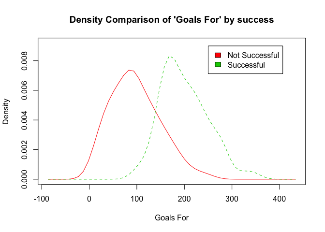 Unlike
the Goal’s For density comparison, the Goal’s against densities were
relatively similar, with the spread being similar, and only the density
around the average being higher for the Successful teams, versus the Not
Successful teams. However, another large difference is seen when looking
at the summary. The IQR, and the maximum goals against are both lower
for Successful teams, which is why the density graph shows a higher
peak.

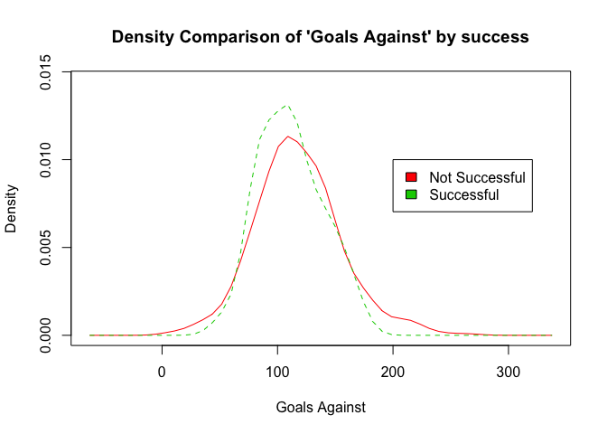

    ## $N
    ##    Min. 1st Qu.  Median    Mean 3rd Qu.    Max. 
    ##     4.0    94.0   115.0   117.7   139.0   271.0 
    ## 
    ## $Y
    ##    Min. 1st Qu.  Median    Mean 3rd Qu.    Max. 
    ##    49.0    88.0   111.5   111.4   131.0   176.0

The Last initial visualization to analyze is where ‘Successful’ teams
are when plotted in regards to Wins and Losses. Below, is the expected
result, with successful teams, in blue, populating the right side of the
graph, and the National Champions, in green, in the bottom, right
quadrant.  
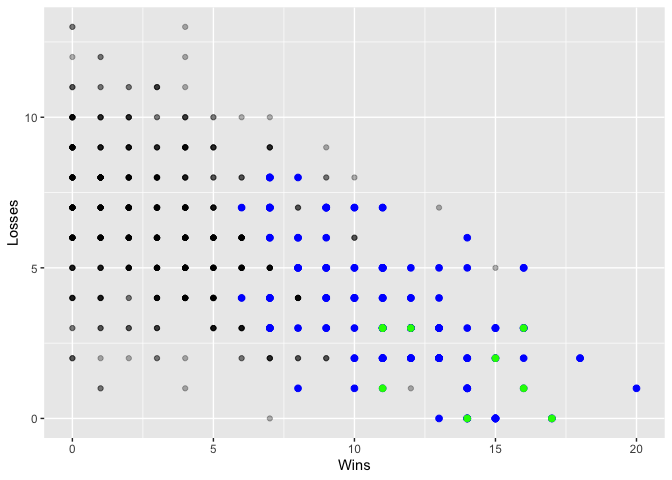

## Distributions

Next are the distributions of the variables to see if they are Normal.
Based on the initial visualizations, it is predicted that Goals For will
be skewed to the right, and Goals against will be be more normally
distributed in a bell curve.  
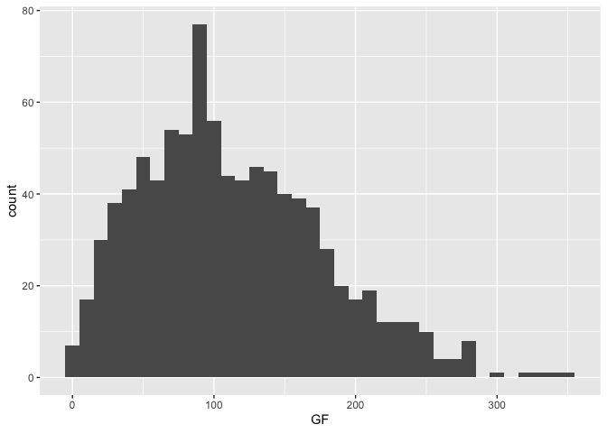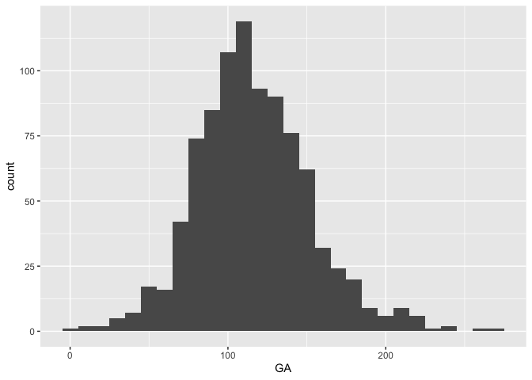

As expected, the histograms show the predicted result; however, the
Goals For histogram is not as skewed as one may think based on the
summary and initial observations.

Next, looking at wins and losses, we see wins are heavily skewed to the
right and losses are uniformly distributed.  
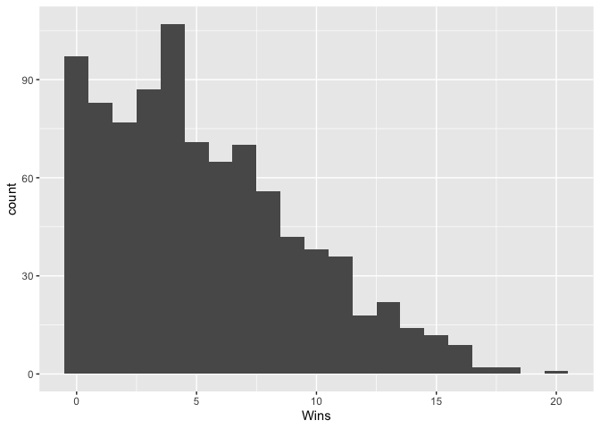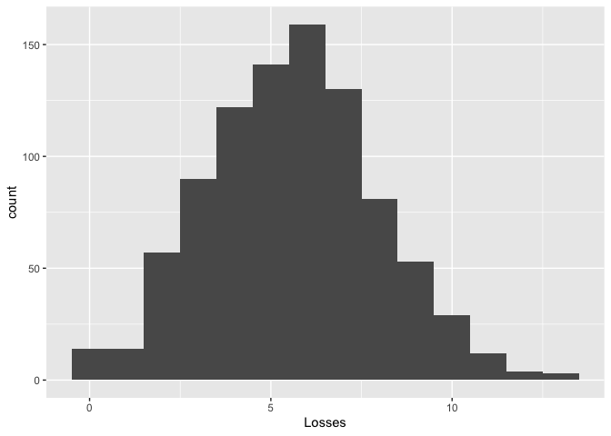
The last two variables to observe distributions of are Division Wins and
Losses. These variables were not previously show in density because of
the large disparity in conference strength. These variables are also not
the best metrics for observing distribution because you are technically
only required to have 4 conference games each year in order to be
eligible for the conference and national tournaments. In my
observations, most teams only play the minimum amount of conference
games, therefore there is not as many bins for the data.

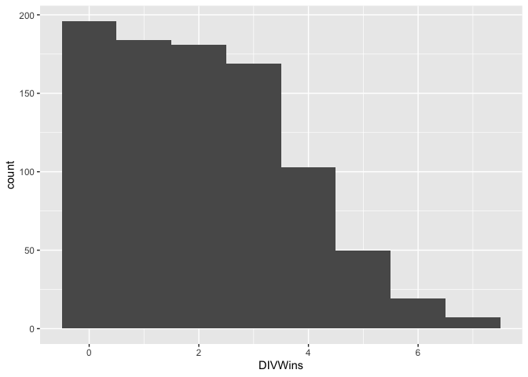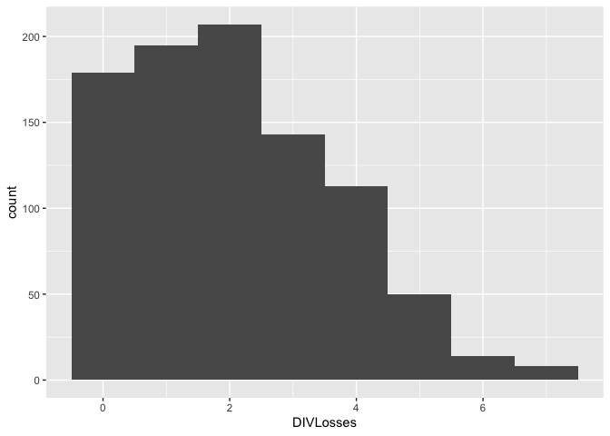

## Correlation and Regression

To start off correlation I isolated the numerical variables and looked
for any strong correlations between them. The three strongest positive
correlations are between Goals For and Wins (.92), Wins and Division
Wins (.71), and Goals Against and Losses (.70). None of these
correlations were a surprise, especially Wins and Division Wins. The
three strongest negative correlations are between: Wins and Division
Losses (-.67), Division Wins and Losses (-.61), and Goals For and
Division Losses (-.60).

    ##           Column1    GF    GA DIVWins DIVLosses  Wins Losses  Seed
    ## Column1      1.00  0.01 -0.03   -0.01      0.00 -0.01  -0.10  0.05
    ## GF           0.01  1.00  0.14    0.64     -0.60  0.92  -0.39  0.45
    ## GA          -0.03  0.14  1.00   -0.14      0.25 -0.07   0.70 -0.07
    ## DIVWins     -0.01  0.64 -0.14    1.00     -0.61  0.71  -0.46  0.34
    ## DIVLosses    0.00 -0.60  0.25   -0.61      1.00 -0.67   0.55 -0.37
    ## Wins        -0.01  0.92 -0.07    0.71     -0.67  1.00  -0.58  0.51
    ## Losses      -0.10 -0.39  0.70   -0.46      0.55 -0.58   1.00 -0.31
    ## Seed         0.05  0.45 -0.07    0.34     -0.37  0.51  -0.31  1.00

In order to find a linear model to predict champions and seeding I added
a new variable which is numeric value (binary) of champions.I also
created a new data set, of the 2022 teams to predict and test the linear
model against. I then created new datasets consisting only of numeric
variables for all my data, all data except 2022, and only 2022.

I will be looking to first find three linear models to predict if a team
makes it to the national tournament (success), then if a team will
likely be the National Champion without knowing the seed, and then
predicting from the top 16 teams, which team will be the National
Champion  
\#\#\# Regression to predict if a team goes to National tournament  
The first regression model is determined using the AIC forward method.
The final variables that are used are Wins, DIVWins, and Goals Against.

    ## 
    ## Call:
    ## lm(formula = numSuccess ~ 1, data = standings_num)
    ## 
    ## Residuals:
    ##     Min      1Q  Median      3Q     Max 
    ## -0.1584 -0.1584 -0.1584 -0.1584  0.8416 
    ## 
    ## Coefficients:
    ##             Estimate Std. Error t value Pr(>|t|)    
    ## (Intercept)  0.15842    0.01212   13.07   <2e-16 ***
    ## ---
    ## Signif. codes:  0 '***' 0.001 '**' 0.01 '*' 0.05 '.' 0.1 ' ' 1
    ## 
    ## Residual standard error: 0.3653 on 908 degrees of freedom

    ## Start:  AIC=-1829.64
    ## numSuccess ~ 1
    ## 
    ##             Df Sum of Sq     RSS     AIC
    ## + Wins       1    51.444  69.744 -2329.9
    ## + GF         1    41.885  79.303 -2213.1
    ## + DIVLosses  1    22.426  98.762 -2013.6
    ## + Losses     1    19.443 101.745 -1986.6
    ## + DIVWins    1    14.977 106.211 -1947.5
    ## + GA         1     0.497 120.691 -1831.4
    ## <none>                   121.188 -1829.6
    ## 
    ## Step:  AIC=-2329.87
    ## numSuccess ~ Wins
    ## 
    ##             Df Sum of Sq    RSS     AIC
    ## + DIVWins    1   2.82944 66.914 -2365.5
    ## <none>                   69.744 -2329.9
    ## + GF         1   0.09954 69.644 -2329.2
    ## + Losses     1   0.07208 69.672 -2328.8
    ## + GA         1   0.05337 69.691 -2328.6
    ## + DIVLosses  1   0.01961 69.724 -2328.1
    ## 
    ## Step:  AIC=-2365.52
    ## numSuccess ~ Wins + DIVWins
    ## 
    ##             Df Sum of Sq    RSS     AIC
    ## + GA         1   0.20163 66.713 -2366.3
    ## + Losses     1   0.15835 66.756 -2365.7
    ## <none>                   66.914 -2365.5
    ## + GF         1   0.13321 66.781 -2365.3
    ## + DIVLosses  1   0.08375 66.831 -2364.7
    ## 
    ## Step:  AIC=-2366.26
    ## numSuccess ~ Wins + DIVWins + GA
    ## 
    ##             Df Sum of Sq    RSS     AIC
    ## <none>                   66.713 -2366.3
    ## + DIVLosses  1  0.032648 66.680 -2364.7
    ## + GF         1  0.025760 66.687 -2364.6
    ## + Losses     1  0.002957 66.710 -2364.3

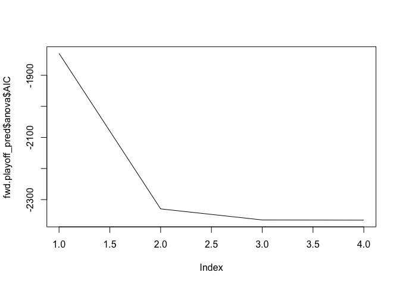

    success_pred <- lm(numSuccess ~ Wins, DIVWins + GA, data = standings_num)
    summary(success_pred)

    ## 
    ## Call:
    ## lm(formula = numSuccess ~ Wins, data = standings_num, subset = DIVWins + 
    ##     GA)
    ## 
    ## Residuals:
    ##      Min       1Q   Median       3Q      Max 
    ## -0.72835 -0.13049 -0.02179  0.14126  0.76081 
    ## 
    ## Coefficients:
    ##              Estimate Std. Error t value Pr(>|t|)    
    ## (Intercept) -0.141258   0.013359  -10.57   <2e-16 ***
    ## Wins         0.054350   0.001971   27.58   <2e-16 ***
    ## ---
    ## Signif. codes:  0 '***' 0.001 '**' 0.01 '*' 0.05 '.' 0.1 ' ' 1
    ## 
    ## Residual standard error: 0.2576 on 907 degrees of freedom
    ## Multiple R-squared:  0.4561, Adjusted R-squared:  0.4555 
    ## F-statistic: 760.5 on 1 and 907 DF,  p-value: < 2.2e-16

The model ‘success\_pred’, a model to determine if a team makes the
playoffs, has an F-statistic of 246.3 meaning that there is a
relationship between the predictor and response variables. However R
squared is only .4495, which is not very close to 1 meaning this model
isn’t a great fit, but is the best fit available.

    ## # A tibble: 16 × 4
    ##    TEAM                     Seed success pred_play
    ##    <chr>                   <dbl> <fct>       <dbl>
    ##  1 Montana_22                  6 Y           0.728
    ##  2 St. Thomas_22               1 Y           0.674
    ##  3 UNC-Charlotte_22           15 Y           0.511
    ##  4 Utah_22                     5 Y           0.511
    ##  5 UC San Diego_22            13 Y           0.457
    ##  6 Missouri State_22           9 Y           0.457
    ##  7 Rhode Island_22             7 Y           0.457
    ##  8 Florida Gulf Coast_22      11 Y           0.402
    ##  9 Utah State_22              10 Y           0.402
    ## 10 Grand Valley State_22       4 Y           0.402
    ## 11 Kennesaw State_22           3 Y           0.402
    ## 12 College of Idaho_22         2 Y           0.402
    ## 13 UC Davis_22                 0 N           0.402
    ## 14 Florida Atlantic_22        16 Y           0.348
    ## 15 Cal State San Marcos_22    14 Y           0.348
    ## 16 Montana State_22            8 Y           0.348

This regression model correctly predicted 14 out of the 16 teams that
got invited to the national tournament this year, by ranking the teams
by the value of pred\_play\_22. This was better than I expected, because
teams get an automatic bid for winning their conference, so underdog’s
sometimes could win, but not be a top 16 team statistically.

### Predicting Champions

I went about creating a prediction model for finding a champion given no
playoff knowledge. This model had much different results than the
previous. The best F-statistic I was able to get was 15.41 and the
highest R-squared was .0524. I believe the reasoning for this is because
of how few champions there were in the data (only 8 in the training
data). I had hypothesized that this would be an easier metric than
predicting the playoff’s because of underdogs receiving an automatic bid
for winning their conference. However, as seen in the summary and plots
below, this model doesn’t predict very well.

    ## 
    ## Call:
    ## lm(formula = numChamp ~ GF + GA + Wins + Losses, data = not22Stand_num)
    ## 
    ## Residuals:
    ##      Min       1Q   Median       3Q      Max 
    ## -0.08526 -0.02164 -0.00418  0.00712  0.94674 
    ## 
    ## Coefficients:
    ##               Estimate Std. Error t value Pr(>|t|)    
    ## (Intercept) -0.0013313  0.0142037  -0.094 0.925346    
    ## GF          -0.0004473  0.0001530  -2.924 0.003551 ** 
    ## GA           0.0003520  0.0001630   2.159 0.031104 *  
    ## Wins         0.0095450  0.0026145   3.651 0.000278 ***
    ## Losses      -0.0054932  0.0029806  -1.843 0.065683 .  
    ## ---
    ## Signif. codes:  0 '***' 0.001 '**' 0.01 '*' 0.05 '.' 0.1 ' ' 1
    ## 
    ## Residual standard error: 0.09469 on 834 degrees of freedom
    ## Multiple R-squared:  0.05629,    Adjusted R-squared:  0.05176 
    ## F-statistic: 12.44 on 4 and 834 DF,  p-value: 7.883e-10

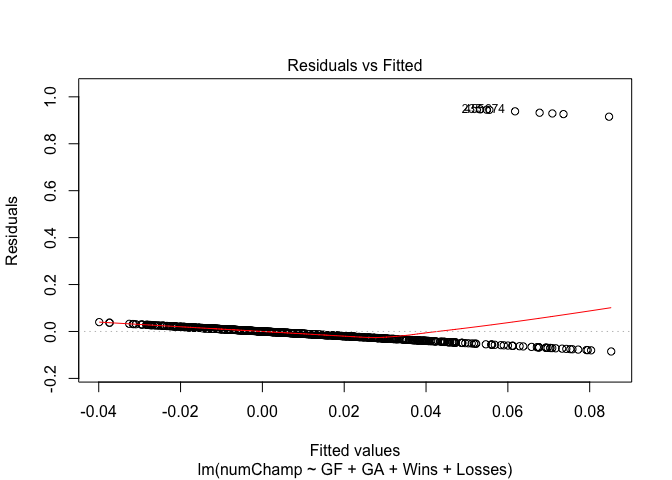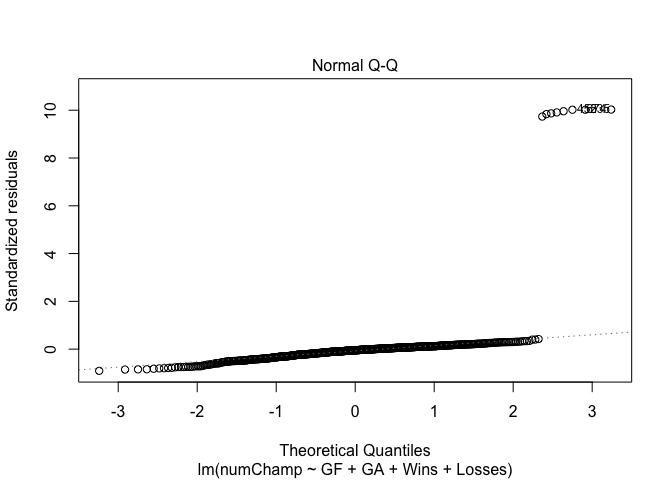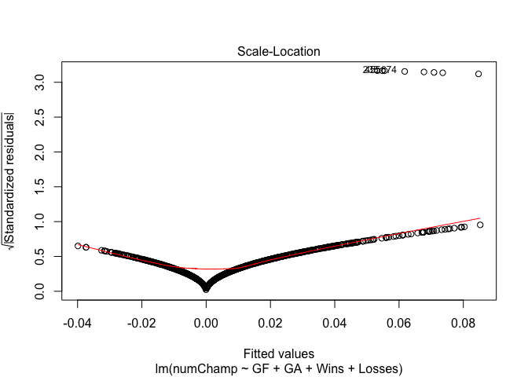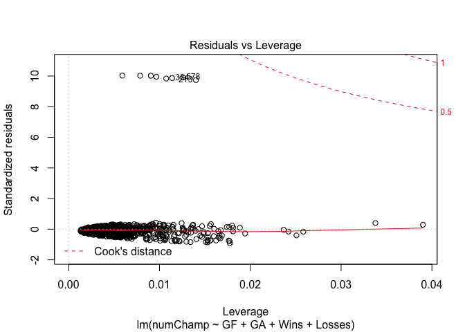
I decided to test my model and see what the top 5 most likely champions
were predicted to be. The top five most likely champions were all in the
tournament, and the eventual winner had the 3rd highest value from the
model.

    ## # A tibble: 5 × 4
    ##   TEAM                   Seed success noPlayChamp
    ##   <chr>                 <dbl> <fct>         <dbl>
    ## 1 Montana State_22          8 Y            0.0645
    ## 2 Kennesaw State_22         3 Y            0.0583
    ## 3 Utah_22                   5 Y            0.0507
    ## 4 College of Idaho_22       2 Y            0.0443
    ## 5 Grand Valley State_22     4 Y            0.0356

### Regression model of Champions Given Seeds

    ## 
    ## Call:
    ## lm(formula = numChamp ~ 1, data = df_not22)
    ## 
    ## Residuals:
    ##      Min       1Q   Median       3Q      Max 
    ## -0.99046  0.00954  0.00954  0.00954  0.00954 
    ## 
    ## Coefficients:
    ##             Estimate Std. Error t value Pr(>|t|)    
    ## (Intercept) 0.990465   0.003357     295   <2e-16 ***
    ## ---
    ## Signif. codes:  0 '***' 0.001 '**' 0.01 '*' 0.05 '.' 0.1 ' ' 1
    ## 
    ## Residual standard error: 0.09724 on 838 degrees of freedom

    ## Start:  AIC=-3909.71
    ## numChamp ~ 1
    ## 
    ##              Df Sum of Sq    RSS     AIC
    ## + numSuccess  1   0.42372 7.5000 -3953.8
    ## + Wins        1   0.32775 7.5960 -3943.2
    ## + Losses      1   0.21962 7.7041 -3931.3
    ## + GF          1   0.17410 7.7496 -3926.4
    ## + DIVLosses   1   0.09914 7.8246 -3918.3
    ## + DIVWins     1   0.08818 7.8355 -3917.1
    ## <none>                    7.9237 -3909.7
    ## + GA          1   0.00846 7.9153 -3908.6
    ## + Seed        1   0.00300 7.9207 -3908.0
    ## 
    ## Step:  AIC=-3953.82
    ## numChamp ~ numSuccess
    ## 
    ##             Df Sum of Sq    RSS     AIC
    ## + Seed       1   0.99412 6.5059 -4071.1
    ## + Losses     1   0.04786 7.4521 -3957.2
    ## + Wins       1   0.04079 7.4592 -3956.4
    ## <none>                   7.5000 -3953.8
    ## + DIVWins    1   0.00504 7.4950 -3952.4
    ## + GF         1   0.00303 7.4970 -3952.2
    ## + DIVLosses  1   0.00170 7.4983 -3952.0
    ## + GA         1   0.00167 7.4983 -3952.0
    ## 
    ## Step:  AIC=-4071.12
    ## numChamp ~ numSuccess + Seed
    ## 
    ##             Df Sum of Sq    RSS     AIC
    ## + DIVWins    1 0.0257347 6.4801 -4072.4
    ## + Losses     1 0.0225204 6.4834 -4072.0
    ## <none>                   6.5059 -4071.1
    ## + GF         1 0.0084278 6.4975 -4070.2
    ## + GA         1 0.0064992 6.4994 -4070.0
    ## + Wins       1 0.0051079 6.5008 -4069.8
    ## + DIVLosses  1 0.0026627 6.5032 -4069.5
    ## 
    ## Step:  AIC=-4072.45
    ## numChamp ~ numSuccess + Seed + DIVWins
    ## 
    ##             Df Sum of Sq    RSS     AIC
    ## + GF         1  0.055213 6.4249 -4077.6
    ## <none>                   6.4801 -4072.4
    ## + Losses     1  0.009161 6.4710 -4071.6
    ## + GA         1  0.003868 6.4763 -4071.0
    ## + Wins       1  0.003018 6.4771 -4070.8
    ## + DIVLosses  1  0.002107 6.4780 -4070.7
    ## 
    ## Step:  AIC=-4077.63
    ## numChamp ~ numSuccess + Seed + DIVWins + GF
    ## 
    ##             Df Sum of Sq    RSS     AIC
    ## + Wins       1  0.047352 6.3776 -4081.8
    ## <none>                   6.4249 -4077.6
    ## + Losses     1  0.008394 6.4165 -4076.7
    ## + GA         1  0.000672 6.4243 -4075.7
    ## + DIVLosses  1  0.000085 6.4248 -4075.6
    ## 
    ## Step:  AIC=-4081.83
    ## numChamp ~ numSuccess + Seed + DIVWins + GF + Wins
    ## 
    ##             Df Sum of Sq    RSS     AIC
    ## + GA         1 0.0156950 6.3619 -4081.9
    ## <none>                   6.3776 -4081.8
    ## + DIVLosses  1 0.0027928 6.3748 -4080.2
    ## + Losses     1 0.0010217 6.3766 -4080.0
    ## 
    ## Step:  AIC=-4081.9
    ## numChamp ~ numSuccess + Seed + DIVWins + GF + Wins + GA
    ## 
    ##             Df Sum of Sq    RSS     AIC
    ## <none>                   6.3619 -4081.9
    ## + Losses     1 0.0089801 6.3529 -4081.1
    ## + DIVLosses  1 0.0005987 6.3613 -4080.0

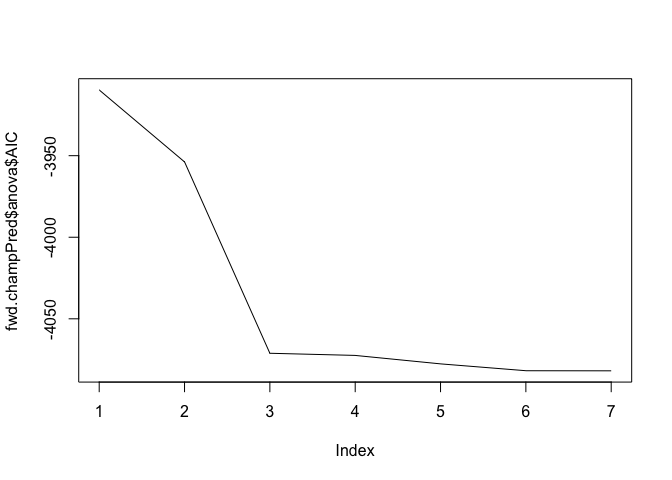 The
final variables chosen were the binary variable numSuccess, which tells
whether or not a team made the playoffs, their playoff Seed, Division
Wins, Goals For, and Wins. This generated a R-squared of .1951, and an
F-statistic of 40.39. Neither of these metrics show theres a great deal
of fit; however, this again may be because of the low amount of National
Champions.

    champPred <- lm(numChamp ~ numSuccess + Seed + DIVWins + GF + Wins, data = df_not22)
    summary(champPred)

    ## 
    ## Call:
    ## lm(formula = numChamp ~ numSuccess + Seed + DIVWins + GF + Wins, 
    ##     data = df_not22)
    ## 
    ## Residuals:
    ##      Min       1Q   Median       3Q      Max 
    ## -0.88761 -0.00794  0.00071  0.01048  0.21742 
    ## 
    ## Coefficients:
    ##               Estimate Std. Error t value Pr(>|t|)    
    ## (Intercept)  0.9895108  0.0069203 142.988  < 2e-16 ***
    ## numSuccess  -0.2290811  0.0197516 -11.598  < 2e-16 ***
    ## Seed         0.0200487  0.0017472  11.475  < 2e-16 ***
    ## DIVWins     -0.0046046  0.0027129  -1.697  0.09002 .  
    ## GF           0.0004342  0.0001204   3.606  0.00033 ***
    ## Wins        -0.0055171  0.0022185  -2.487  0.01308 *  
    ## ---
    ## Signif. codes:  0 '***' 0.001 '**' 0.01 '*' 0.05 '.' 0.1 ' ' 1
    ## 
    ## Residual standard error: 0.0875 on 833 degrees of freedom
    ## Multiple R-squared:  0.1951, Adjusted R-squared:  0.1903 
    ## F-statistic: 40.39 on 5 and 833 DF,  p-value: < 2.2e-16

    ## # A tibble: 10 × 4
    ##    TEAM                numChamp pred_play championPred
    ##    <chr>                  <dbl>     <dbl>        <dbl>
    ##  1 Montana State_22           1    0.348          1.10
    ##  2 Kennesaw State_22          1    0.402          1.08
    ##  3 Utah_22                    0    0.511          1.07
    ##  4 Wyoming_22                 1   -0.0326         1.03
    ##  5 Western Oregon_22          1    0.0761         1.03
    ##  6 College of Idaho_22        1    0.402          1.02
    ##  7 San Diego_22               1   -0.0869         1.02
    ##  8 Maine_22                   1    0.0218         1.02
    ##  9 North Texas_22             1    0.130          1.01
    ## 10 Southern Oregon_22         1   -0.0869         1.01

# Topics From Class

## Topic 1: R Markdown

R Markdown was used to make the method used, metrics gathered, and
analyzed results easier to read in a common format.

## Topic 2: Github

Github was used to publish findings and how the final results were
determined.

## Topic 3: Distribution and ggplot

GGPlot will be used to show distributions of statistics and frequencies
of teams selected to the national tournament

## Topic 4: Linear Regression and Correlation

Linear Regression was used to find try and predict if a team would be
selected to make it to the national tournament and be considered a
“successful team”. This was also used to predict which team, from the
top 16 would become then National Champion.

## Topic 5: Probability

Probability was used to make and show predictions of results based on
the data available. Probability was also used in distribution
histograms. Showing if you score a certain amount of points, or gather
enough wins, you have a higher probability of making the tournament.
This will also be tested against the real results to show accuracy,
train algorithms, and provide evidence for theories.

# Conclusion

Before this project, I expected to find the Goals Against, Goals For,
and Wins were the most important variables when predicting success. I
also believed that I would be able to create pretty reliable and
accurate models for predicting future National Champions. However, on a
couple of fronts I refuted my hypotheses. First of all, I found that it
was easier to accurately predict the teams that would be admitted to the
tournament. Using Wins, Division wins and Goals against I created a
model with a strong fit that correctly predicted 14/16 teams in the
tournament. Looking at my first visuals, this makes more sense. There is
a large drop off from playoff team’s stats, versus teams that didn’t
make it. I was surprised at my last model, creating a regression model
that included the playoff seeds team’s had. Since 2012, only one time
did a seed other than 1 or 2 win, so having such a low fit seemed odd;
however, it the model was correct in not having confidence as a 6 seed
won this year. In Conclusion, I learned a great deal about regression,
probability, and visualizing data with ggplot.
